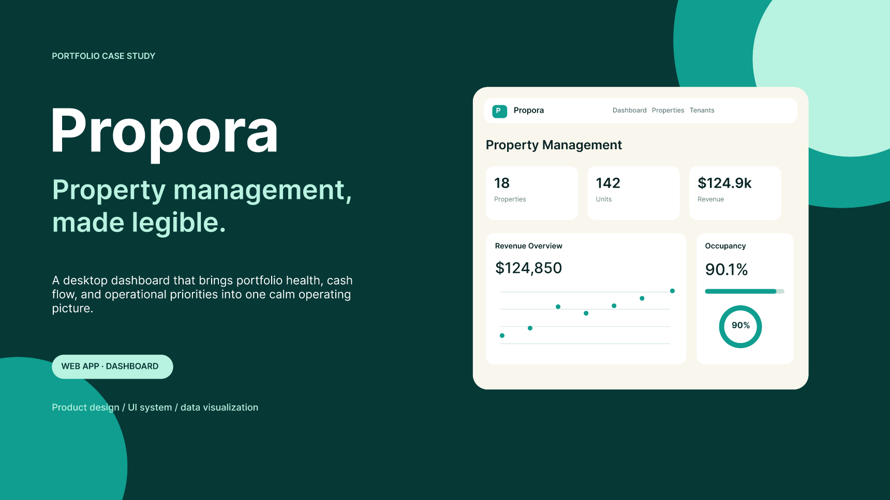
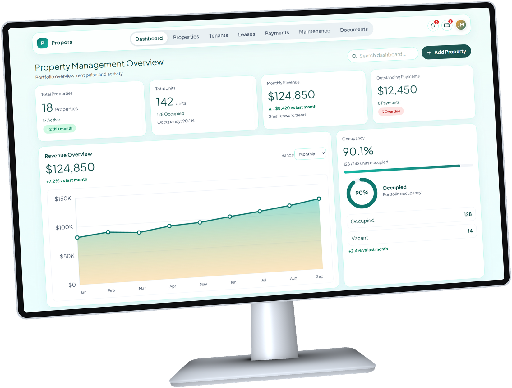

<div align="center">


# Propora

### Property management, made legible.

A full-stack property-management platform — a real REST API, a data-driven
operations dashboard, and a marketing site — built end to end as a portfolio
case study in product thinking, interface craft, and backend design.


**`FULL-STACK · PRODUCT DESIGN · CASE STUDY`**

</div>



---

## About this project

Property managers live in spreadsheets: units here, arrears there, maintenance
requests in someone's inbox. **Propora** collapses that into one calm operating
picture — properties, tenants, leases, payments, maintenance, and documents,
all in a single screen where the answer to *"how is my portfolio doing?"* is
legible in under five seconds.

It's built as three independent, purpose-built repositories rather than one
monolith — the way a real product team would split frontend, backend, and
marketing concerns:

| Repository | Role | Stack | Source |
| ---------- | ---- | ----- | ------ |
| **[Propora](./Propora)** | The product — a session-authenticated dashboard for the full property-management workflow | React 19 · TypeScript · Vite · Tailwind CSS v4 · Zustand · React Router | [Propora-Frontend](https://github.com/m0hkx/Propora-Frontend) |
| **[Propora-API](./Propora-API)** | The backend — a multi-tenant REST API with session auth, file uploads, and MongoDB persistence | Express 5 · TypeScript (ESM) · MongoDB (native driver) · express-session · multer | [Propora-Backend](https://github.com/m0hkx/Propora-Backend) |
| **[ProporaWebsite](./ProporaWebsite)** | The pitch — a marketing/landing site introducing the product | React 19 · TypeScript · Vite · hand-rolled CSS design system | [Propora-Website](https://github.com/m0hkx/Propora-Website) |

Every screen in the dashboard is backed by a real, running API — not mocked
data pretending to be a backend. The one deliberate exception is the inbox/chat
feature, which is called out explicitly in the frontend's own docs rather than
quietly faked.

## Product tour



| Area | Highlights |
| ---- | ---------- |
| **Dashboard** | Animated KPI hero cards, revenue area chart, occupancy donut, property performance, action-required triage |
| **Properties** | Portfolio summary, status/type filters, per-unit breakdown, image upload, create/edit flows |
| **Tenants** | Full roster with search, sorting, pagination, and deep links into leases & payments |
| **Leases** | Status + property filters, tenant-scoped focus mode via shareable URLs |
| **Payments** | Collection KPIs, status/method filters, record-payment flow with automatic overdue notifications |
| **Maintenance** | Work-queue triage, staff assignment, status lifecycle (Open → In Progress → Paused/Completed) with a full history trail |
| **Documents** | Property/tenant-scoped document vault with upload, archive, and expiration tracking |
| **Notifications** | Server-generated activity feed — new tenants, overdue payments, new maintenance requests |

## System overview

- **Auth** — `express-session` cookie, `bcryptjs` password hashing; every document in
  MongoDB carries a `userId`, and every query is scoped to the logged-in user.
- **Uploads** — property images and documents are stored on disk (`multer`) and served
  statically; the frontend resolves them into absolute URLs.
- **State** — the dashboard's Zustand store is hydrated entirely from the API on login;
  every mutation is an `await` against a real endpoint, not a local reducer.

## Design system

One teal identity carried through every surface, across all three repos:

- **Palette** — Trust Teal `#0F766E` on a mint wash `#F0FDFA`, deep-teal ink `#134E4A`
  (never pure black), semantic badge tones for every status
- **Type** — Plus Jakarta Sans throughout, tabular numerals so metrics never jitter
- **Shape & depth** — 18px cards, mint-tinted borders, teal-tinted shadows, pill actions
- **Logo** — a single geometric "P" mark (`docs/images/logo.png`), used flat on the
  marketing site and as a white cutout on the teal brand badge in-app

Full token reference: [`Propora/docs/design-system/colors.md`](./Propora/docs/design-system/colors.md)
and [`ProporaWebsite/design-system/colors.md`](./ProporaWebsite/design-system/colors.md).

## Documentation map

Each repo documents itself in depth — this README is the map, not a replacement:

| Doc | Covers |
| --- | ------ |
| [`Propora-API/docs/`](./Propora-API/docs) | Backend architecture, auth, data model, and the full REST API reference |
| [`Propora/README.md`](./Propora/README.md) | Dashboard-specific setup and feature tour |
| [`Propora-API/README.md`](./Propora-API/README.md) | API setup, environment variables, and endpoint summary |
| [`ProporaWebsite/README.md`](./ProporaWebsite/README.md) | Marketing site setup |

## Running the full stack locally

The three apps are independent git repositories that live side by side. To run the
whole product end to end:

```bash
# 1. Backend — needs a MongoDB connection string and a session secret
cd Propora-API
cp .env.example .env   # fill in MONGODB_URI and SESSION_SECRET
npm install
npm run dev             # http://localhost:3000

# 2. Dashboard — talks to the API above
cd ../Propora
npm install
npm run dev              # http://localhost:5173

# 3. Marketing site — standalone, no backend dependency
cd ../ProporaWebsite
npm install
npm run dev              # http://localhost:5174 (or next free port)
```

The API's CORS policy is locked to `http://localhost:5173` and issues a
credentialed session cookie, so the dashboard must be served from that origin
in development.

## Why this project

This repo set is a deliberately realistic slice of what shipping a small SaaS
product looks like solo: a documented, multi-tenant API; a polished, fully
interactive frontend consuming it for real; and a marketing surface that sells
the same story visually. It's meant to demonstrate range — product design,
frontend craft, backend architecture, and the judgment to document trade-offs
honestly — rather than a single narrow skill.

---

<div align="center">

Built by [**@m0hkx**](https://github.com/m0hkx) as a full-stack portfolio case study.

</div>
