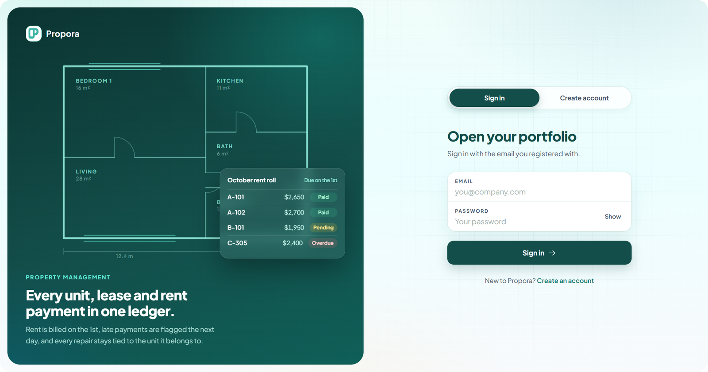
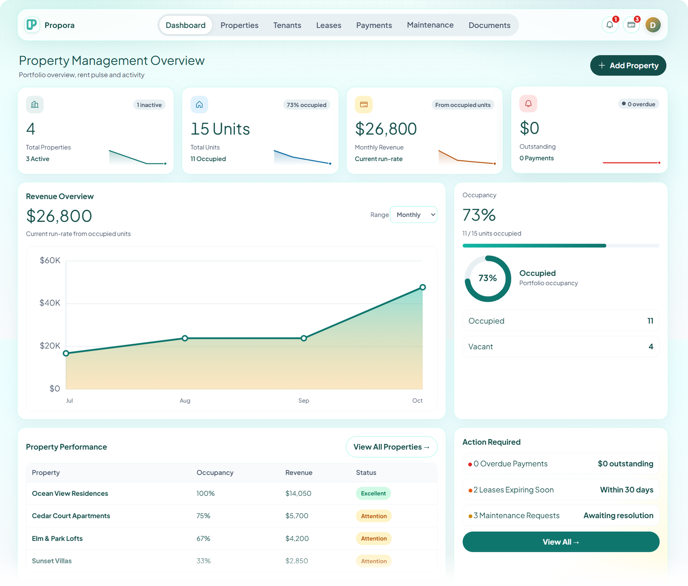
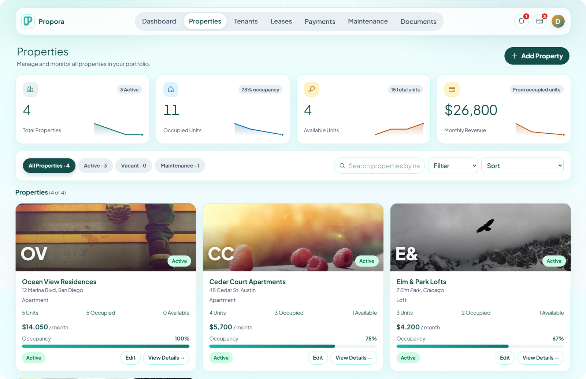
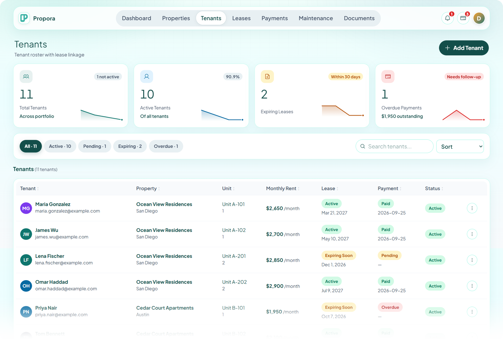
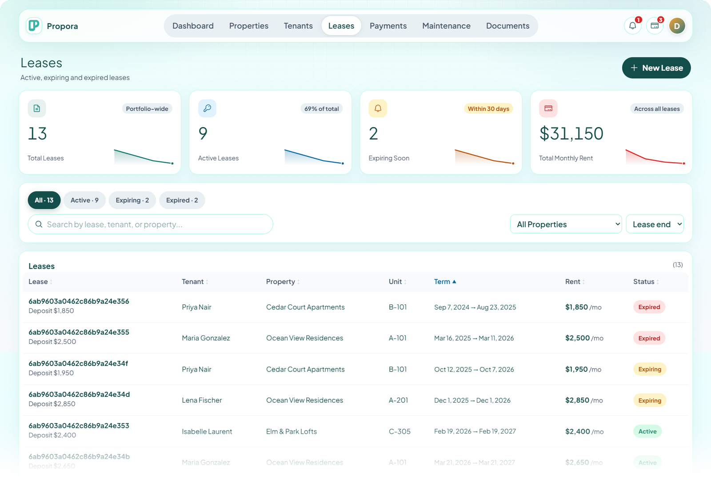
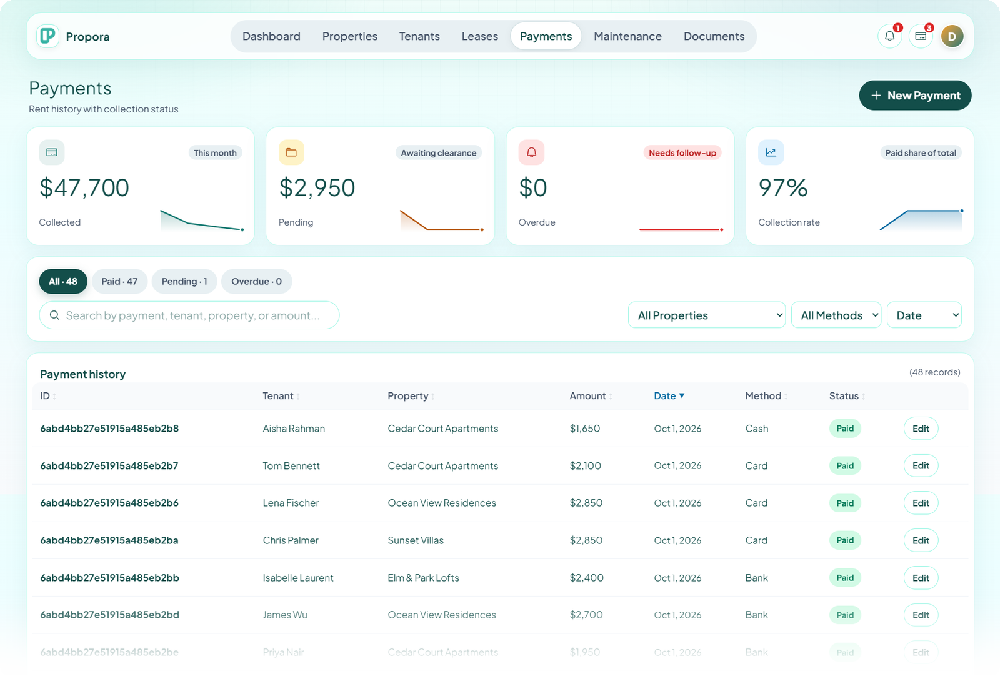
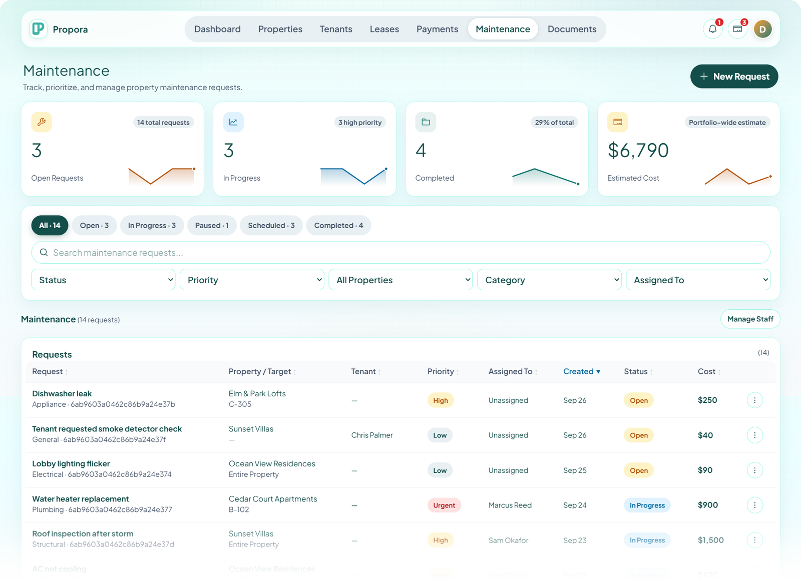
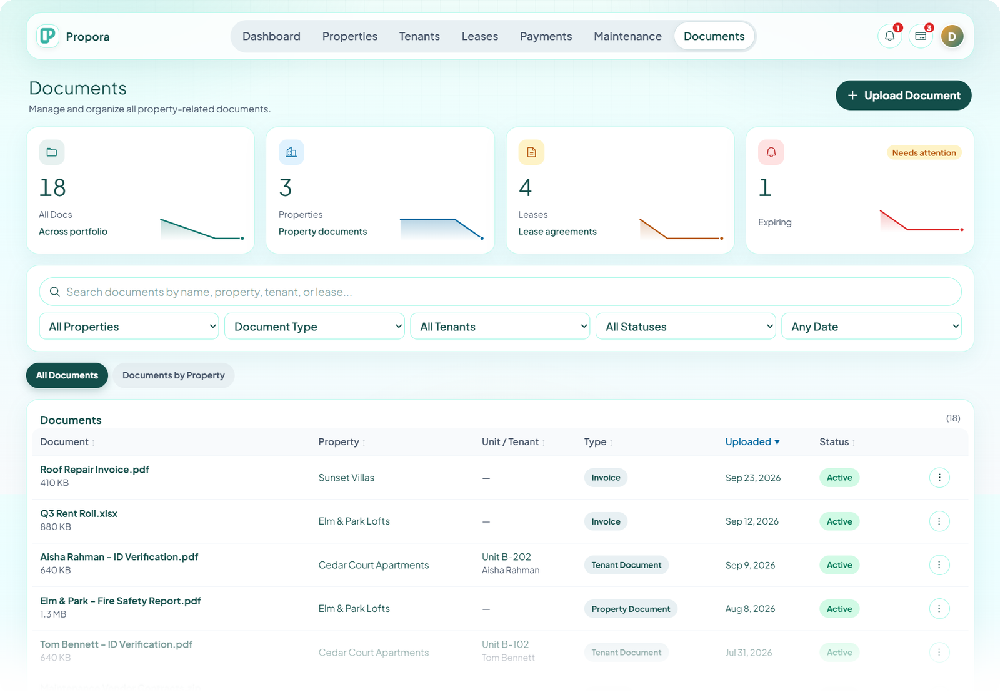

[Docs](./README.md) › **Screenshots**

# Screenshots

A quick tour of Propora, using the demo account's data.

[Sign in](#sign-in) · [Dashboard](#dashboard) · [Properties](#properties) · [Tenants](#tenants) · [Leases](#leases) · [Payments](#payments) · [Maintenance](#maintenance) · [Documents](#documents)

---

### Sign in

A split-screen sign-in page with a floor-plan illustration and a sample rent roll. Switch between *Sign in* and *Create account* in one click.

### Dashboard

The answer to *"How is my portfolio doing?"* KPI cards, revenue trend, occupancy, property performance and an *Action required* list.

### Properties

Every building as a card, with photo, occupancy bar and monthly revenue. Filter by status, search, and sort.

### Tenants

The full roster with lease and payment status side by side, so problems stand out.

### Leases

Active, expiring and expired leases, with each lease's term, rent and deposit.

### Payments

Collected, pending and overdue rent, plus the collection rate. Filter by property or payment method.

### Maintenance

A work queue for repairs, with priority, assigned staff, status and cost.

### Documents

Leases, invoices, insurance and ID files, linked to a property, unit or tenant, with expiry tracking.

---

[← Case study](./01-case-study.md) · [Docs home](./README.md) · [Features →](./03-features.md)

