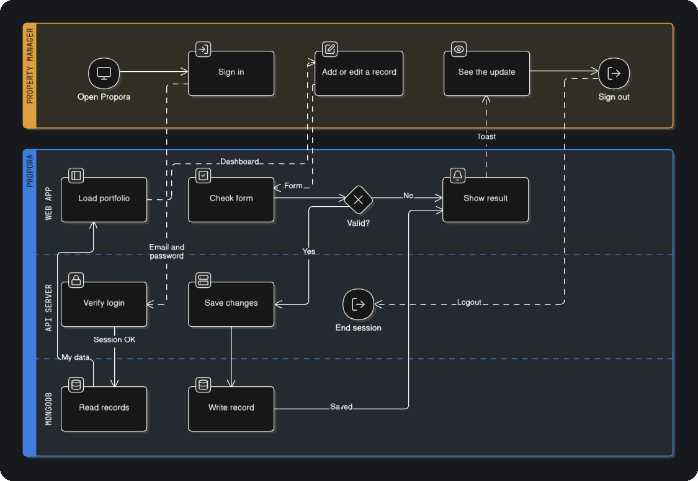
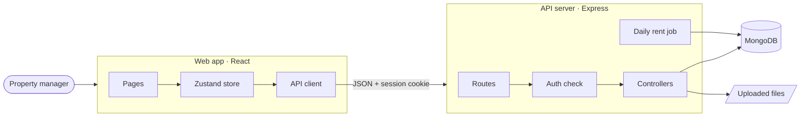

[Docs](./README.md) › **System design**

# System design

Propora has three parts: a **web app** that people use, an **API server** that holds the rules, and a **MongoDB database** that stores the data.



The top lane is what the **property manager** does. The bottom lane shows what **Propora** does in response, split into the web app, the API server and MongoDB.

## The three parts



| Part | Built with | Job |
| --- | --- | --- |
| **Web app** | React 19, Zustand, React Router, Tailwind CSS | Shows the screens, checks forms early, and keeps the loaded data in one store |
| **API server** | Express 5, TypeScript | Signs users in, applies the business rules, saves data, stores uploads, runs the daily rent job |
| **Database** | MongoDB | Stores one collection per resource, with every record tagged by its owner |

## How a request flows

1. **Sign in.** The app sends email and password. The API checks the password hash and starts a session. The browser keeps a secure cookie.
2. **Load the portfolio.** The app fetches properties first, then units, tenants, leases, payments, repairs, staff, documents and notifications in parallel.
3. **Edit a record.** The form checks the input. If it's valid, the app sends it to the API.
4. **Save.** The API checks the session, applies its own rules, and writes to MongoDB, always filtered by the user's id.
5. **Show the result.** The app merges the saved record from the server into its store, and a toast confirms the change. If something fails, the server's message is shown instead.

## Inside the web app

```
src/
├── pages/        one folder per screen, with its modals beside it
├── components/   shared UI: cards, tables, modals, charts, filters
├── state/        one Zustand store, split into slices per area
├── api/          one file per backend resource, on a shared fetch helper
├── auth/         session check, login state, protected routes
├── lib/          small pure helpers: validation, sorting, formatting
├── types/        shared TypeScript types for every entity
└── styles/       Tailwind v4 layers and shared component classes
```

- **One store, many slices.** Each area (properties, tenants, payments…) has its own slice, and pages subscribe only to what they use.
- **The server owns the data.** The app never makes up ids or saves locally. It sends a request, waits for the real record, then updates the screen.
- **Two layers of checks.** Forms validate for quick feedback, and the API validates again before saving.

## Inside the API

```
src/
├── app.ts         start-up: connect to MongoDB, add middleware, mount routes
├── routes/        one router per resource (URL + method → controller)
├── controllers/   one function per endpoint, talks to MongoDB directly
├── middleware/    protect (login check) and upload (file handling)
├── jobs/          the daily rent job and its schedule
├── lib/           pure rent rules and response helpers
└── scripts/       the demo-data seed script
```

- **Simple layers.** Route → controller → database. No extra service layer, so every endpoint is easy to read end to end.
- **One login check.** The `protect` middleware guards every route except the account routes under `/users` (sign up, sign in, sign out, session check).
- **Clean responses.** A shared helper turns MongoDB's `_id` into a plain `id` and removes the owner's `userId` from every response.

## Security basics

| Area | How it's handled |
| --- | --- |
| **Passwords** | Hashed with `bcryptjs`, never returned by any endpoint |
| **Sessions** | `httpOnly` cookie, valid for 24 hours; `secure` and `sameSite=none` in production |
| **CORS** | Only origins listed in `CORS_ORIGIN` can call the API with cookies |
| **Data access** | Every query filters by the logged-in user's id |
| **Uploads** | Checked in the browser by content and size, then saved on the server under random names |

---

<div align="center">

[← Features](./03-features.md) · [Docs home](./README.md) · [Database design →](./05-database-design.md)

</div>
