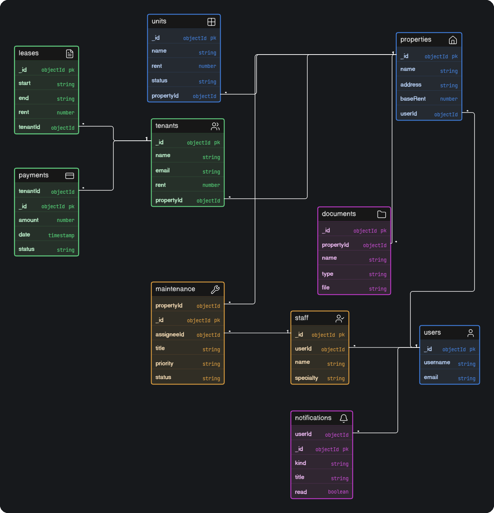

[Docs](./README.md) › **Database design**

# Database design

Propora uses **MongoDB** with **10 collections**, one per kind of record. The diagram shows the key fields of each collection and how they connect.



## The collections

| Collection | Stores | Main links |
| --- | --- | --- |
| `users` | Accounts: username, email, hashed password | Owns everything below |
| `properties` | Buildings: name, address, type, status, base rent, photo | → `users` |
| `units` | Apartments inside a property: name, floor, type, rent, status | → `properties` |
| `tenants` | People renting: contact details, unit, rent, lease and payment status | → `properties`, `units` |
| `leases` | Rental contracts: start, end, rent, deposit, status | → `tenants`, `properties`, `units` |
| `payments` | Rent payments: amount, date, method, status, billing month | → `tenants`, `properties`, `leases` |
| `maintenance` | Repair requests: title, priority, status, cost, history | → `properties`, `units`, `tenants`, `staff` |
| `staff` | Maintenance workers: name, contact, specialty | → `users` |
| `documents` | Uploaded files: type, size, expiry date, status | → `properties`, `tenants`, `leases` |
| `notifications` | Alerts: kind, title, read flag | → `users` |

## How it fits together

```
users
 ├──< properties
 │     ├──< units
 │     ├──< tenants        (each tenant can be linked to one unit)
 │     ├──< leases ──< payments
 │     ├──< maintenance >── staff
 │     └──< documents
 ├──< staff
 └──< notifications
```

*Read `A ──< B` as "one A has many B", and `A >── B` as "many A point to one B".*

## Rules worth knowing

- **Every record has an owner.** Each document stores a `userId`, set from the login session. Every query filters by it, so accounts never see each other's data.
- **Ids are real links.** References like `propertyId` and `tenantId` are stored as MongoDB `ObjectId`s, and turned into plain strings in API responses.
- **One bill per lease per month.** A unique index on `payments (leaseId, period)` stops the rent job from creating the same bill twice.
- **Repairs have a scope.** A maintenance request targets the whole property, a list of `unitIds`, or a list of `tenantIds`. Only the list that matches the scope is filled.
- **History is never rewritten.** Each repair keeps an append-only `history` of status changes and reassignments.
- **Notifications are side effects.** There is no endpoint to create one. They only appear when something real happens, like a new tenant or an overdue payment.
- **Files live on disk, not in the database.** A document stores only the saved file name. The file itself sits in the API's `uploads/` folder.

## Demo data

`npm run seed` in the API creates a demo account with 4 properties, 15 units, 11 tenants, current and past leases, payment history, maintenance requests with staff, documents and notifications. Add `--reset` to wipe it and start again.

---

<div align="center">

[← System design](./04-system-design.md) · [Docs home](./README.md) · [API reference →](./06-api-reference.md)

</div>
