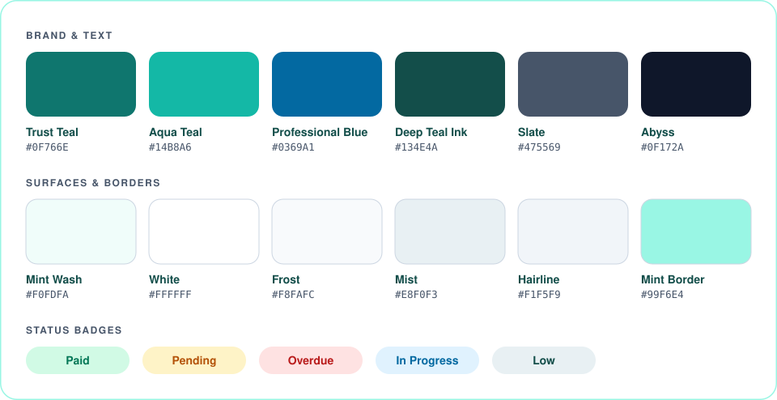

[Docs](./README.md) › **Design system**

# Design system

Propora's look follows one idea: **calm and legible**. One teal brand colour, one font, and the same few components on every page, so the data stands out, not the interface.



## Principles

1. **Teal means action.** Buttons, focus rings, links to act on, and chart lines use Trust Teal. Nothing else competes with it.
2. **Never pure black.** Text uses a deep teal ink (`#134E4A`), which feels softer and stays on-brand.
3. **Colour is never alone.** A status always shows as a badge with a text label, so it still reads for colour-blind users.
4. **Flat by default.** Gradients appear only on the logo, avatars, progress bars and chart fills.

## Colours

| Role | Name | Hex | Used for |
| --- | --- | --- | --- |
| Primary | Trust Teal | `#0F766E` | Main buttons, focus ring, chart lines, progress |
| Secondary | Aqua Teal | `#14B8A6` | Gradients and chart fills |
| Accent | Professional Blue | `#0369A1` | Links and *info* badges |
| Background | Mint Wash | `#F0FDFA` | Page background |
| Surface | White | `#FFFFFF` | Cards, tables, modals |
| Text | Deep Teal Ink | `#134E4A` | Headings and body text |
| Muted text | Slate | `#475569` | Labels and secondary text |
| Border | Mint Border | `#99F6E4` | Inputs, cards and dividers |

## Status colours

Each status pairs a strong text colour with a soft background.

| Tone | Text on background | Used for |
| --- | --- | --- |
| Success | `#047857` on `#D1FAE5` | Paid, Active, Completed |
| Warning | `#B45309` on `#FEF3C7` | Pending, Expiring soon, High priority |
| Danger | `#B91C1C` on `#FEE2E2` | Overdue, Urgent, Paused |
| Info | `#0369A1` on `#E0F2FE` | In progress, Medium priority |
| Neutral | `#134E4A` on `#E8F0F3` | Low priority, Scheduled, types and counts |

All status colours live in one helper (`lib/tone.ts`), so a component never picks a colour by itself.

## Typography

- **Font:** [Plus Jakarta Sans](https://fonts.google.com/specimen/Plus+Jakarta+Sans) everywhere, weights 400–800.
- **Numbers:** tabular figures, so animated KPI counters don't jump around while they count up.
- **Voice:** sentence case and plain verbs, like *"Add property"* and *"Payment recorded"*.

## Shape and depth

| Token | Value | Used for |
| --- | --- | --- |
| Card radius | `18px` | Cards and panels |
| Control radius | `12px` | Inputs, selects, small chips |
| Pill radius | `999px` | Buttons, badges, tabs |
| Card shadow | `0 10px 30px` teal at 8% | Resting cards |
| Hover shadow | `0 16px 40px` teal at 14% | Cards on hover |

Shadows are **tinted teal**, not grey, which keeps depth soft and on-brand.

## Components

| Component | What it looks like |
| --- | --- |
| **Buttons** | Pill shape, bold label. Solid ink or teal for the main action, white "ghost" for the rest. Lifts 1px on hover. |
| **KPI card** | Icon chip, small label, big number that counts up, a context pill and a sparkline |
| **Badge** | Pill with a tinted background and a text label (see status colours above) |
| **Table** | White card, soft header row, hairline dividers, sortable column headers |
| **Modal** | White dialog with an 18px radius over a dimmed teal backdrop. Closes with Escape or a click outside. |
| **Toast** | Dark ink panel with a teal check. Disappears after 3.5 seconds. |
| **Charts** | Hand-drawn SVG: teal line with a teal-to-amber fill, and a teal donut. No chart library. |

## Motion

- **Two easings only:** a soft spring for things appearing, and a quick ease for feedback like button presses.
- **Short:** entrances stay under 500 ms, feedback under 200 ms.
- **Respectful:** all motion turns off when the user's system asks for reduced motion.

## In code

The tokens live in one `@theme` block in `src/index.css` (Tailwind CSS v4), so they work as normal utility classes:

```css
@theme {
  --color-primary: #0F766E;
  --color-background: #F0FDFA;
  --color-foreground: #134E4A;
  --color-border: #99F6E4;
  --radius-card: 18px;
  --shadow-card: 0 10px 30px rgb(15 118 110 / 0.08);
  --font-body: 'Plus Jakarta Sans', system-ui, sans-serif;
}
```

```html
<button class="bg-primary text-white rounded-full">Add property</button>
```

---

<div align="center">

[← API reference](./06-api-reference.md) · [Docs home](./README.md) · [Getting started →](./08-getting-started.md)

</div>
