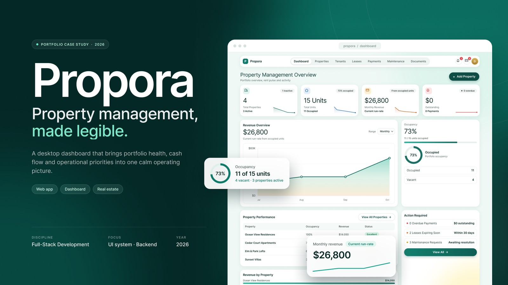
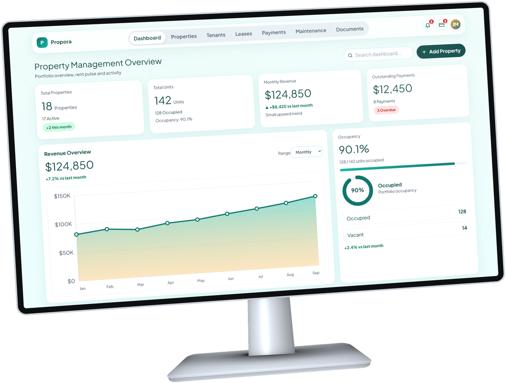

# Propora

**Property management, made legible.**

A full-stack web app that puts properties, tenants, leases, rent, repairs and documents on one calm screen.

[Case study](./01-case-study.md) · [Screenshots](./02-screenshots.md) · [Run it locally](./08-getting-started.md) · [Frontend repo](https://github.com/m0hkx/Propora-Frontend) · [Backend repo](https://github.com/m0hkx/Propora-Backend)

## At a glance

- **What it is:** A dashboard for landlords and property managers to run their whole portfolio in one place
- **Type:** Full-stack web app: a React frontend and an Express + MongoDB REST API
- **My role:** Solo project: product design, UI design, frontend, backend and database
- **Scale:** 8 main screens · 58 API endpoints · 10 database collections
- **Year:** 2026

## Try the demo

Sign in with the demo account. It comes with 4 properties, 15 units, 11 tenants, and a history of leases, payments, repairs and documents.

| Email | Password |
| --- | --- |
| `demo@propora.dev` | `Demo1234!` |

> [!TIP]
> Running it yourself? The demo account is created by `npm run seed` in the API. See [Getting started](./08-getting-started.md).

## Highlights

- **The whole portfolio on one screen.** KPI cards, a revenue trend, occupancy, and an *Action required* list show what needs attention first.
- **Rent bills itself.** A daily server job creates each month's rent and marks unpaid rent as overdue the next day, without ever billing a lease twice.
- **Every account is private.** Each record belongs to one user, and every database query is filtered by the logged-in user.
- **A real backend.** Every screen reads and writes through the REST API. Nothing is faked with local data except the demo chat inbox.
- **Safe file uploads.** Documents are checked by their actual bytes, not just their file name.
- **One design system.** One teal palette, one font and one set of components across every page.

## Tech stack

| Layer | Tools |
| --- | --- |
| **Frontend** | React 19, TypeScript, Vite, Tailwind CSS v4, Zustand, React Router |
| **Backend** | Node.js, Express 5, TypeScript (native ESM) |
| **Database** | MongoDB with the official driver |
| **Auth** | Session cookies (`express-session`) and `bcryptjs` password hashing |
| **Extras** | `multer` for uploads, `node-cron` for scheduled jobs, `libphonenumber-js` for phone numbers |

## Documentation

| # | Page | What you'll find |
| :-: | --- | --- |
| 1 | [Case study](./01-case-study.md) | The problem, the solution, and what I learned |
| 2 | [Screenshots](./02-screenshots.md) | A tour of every screen |
| 3 | [Features](./03-features.md) | What each page does, and what runs in the background |
| 4 | [System design](./04-system-design.md) | How the web app, API and database work together |
| 5 | [Database design](./05-database-design.md) | The collections and how they connect |
| 6 | [API reference](./06-api-reference.md) | Every endpoint on one page |
| 7 | [Design system](./07-design-system.md) | Colours, type, shapes and components |
| 8 | [Getting started](./08-getting-started.md) | Run the project on your machine |
| 9 | [Engineering decisions](./09-engineering-decisions.md) | Key choices, trade-offs and next steps |

## Preview

**[See all screenshots →](./02-screenshots.md)**

---

Designed and built by [**@m0hkx**](https://github.com/m0hkx)

